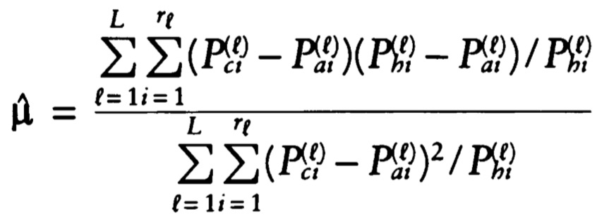

# Admixture Estimator

The code presented here calculates the admixture estimates shown in:

Cox MP, TM Karafet, JS Lansing, H Sudoyo and MF Hammer. 2010. [Autosomal and X-linked single nucleotide polymorphisms reveal a steep Asian-Melanesian ancestry cline in eastern Indonesia and a sex bias in admixture rates](https://doi.org/10.1098/rspb.2009.2041). *Proceedings of the Royal Society B* 277: 1589-1596.

The original admixture estimator was developed by:

Chakraborty R, MI Kamboh, M Nwankwo and RE Ferrell. 1992. [Caucasian genes in American Blacks: New data](https://www.ncbi.nlm.nih.gov/pmc/articles/PMC1682537/). *American Journal of Human Genetics* 50: 145–155.

Specifically, the code implements equation 6 in Chakraborty *et al* (1992):

The [example code](admixture_estimator.R), written in base R, shows an analysis of Asian-Papuan admixture in the Rindi population of Sumba in eastern Indonesia.

While a wide range of genetic data can be used with this code, it is primarily intended to be used with Ancestry Informative Markers (AIMs), which carry substantial information about genetic ancestry.  The basic data structures required by the code are vectors of markers, the number of alleles (not individuals) screened for each marker, and the marker allele frequency relative to the reference population (here, defined as the Asian variant):

|       | Marker 1 | Marker 2  | ... | Marker *n* |
| :--- | :---: | :---: | :---: | :---: |
| Marker | SNP1_chr2_3996214 | SNP2_chr7_152691894 | ... | SNP39_chr22_1984584 |
| Number of Genotypes | 20 | 20 | ... | 20 |
| Reference Allele Frequency | 0.85 | 0.85 | ... | 0.60 |

The same information is required for two proxy parental populations.  In the example code, Han Chinese and Papua New Guinea Highlanders are used as the proxy Asian and Papuan parental populations, respectively.

The code calculates the admixture estimator of Chakraborty *et al* (1992). However, the admixture estimates returned can be quite sensitive to the dataset, especially for small sample sizes. To place statistical bounds on this uncertainty, the code generates random allele frequency densities by pulling samples of observed size *n* from the observed frequency profile. These simulated densities are generated for both proxy parental populations and the admixed population, and Monte Carlo simulation is used to infer both the admixture proportion and estimated variance.

The code returns mean and median estimates of the admixture proportion (relative to the parental reference population), together with assymetric 95% confidence intervals.

> Note: This code was designed for small numbers of ancestry informative markers and will not scale well. For very large numbers of markers (e.g., from SNP genotyping arrays), alternative approaches might be preferable.
